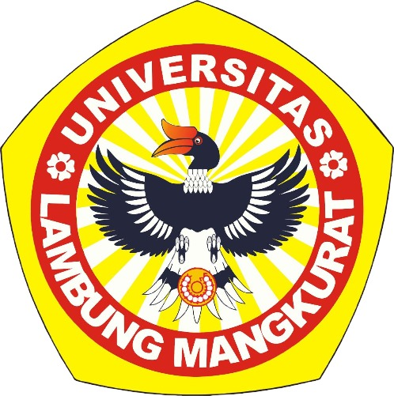
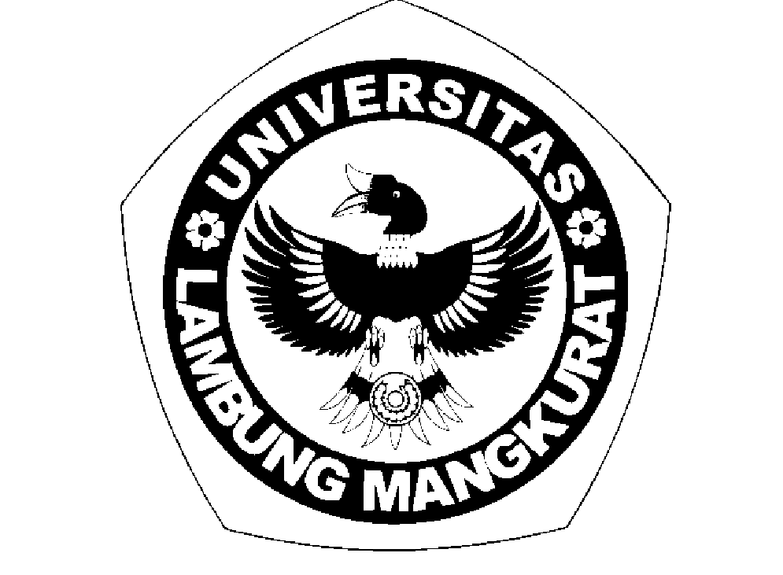
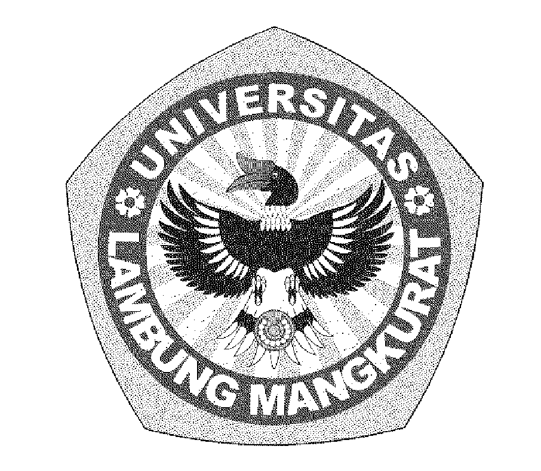

### TUGAS 3  
### PEMROSESAN CITRA DIGITAL  
### (ABKC6306)

### DISUSUN OLEH:  
Muhammad Syauqoni (2310131310007)  
### DOSEN PENGAMPU:  
Dr. Harja Santana Purba, M.Kom./Novan A.B. Saputra, S.Kom., M.T

### PROGRAM STUDI PENDIDIKAN KOMPUTER  
### FAKULTAS KEGURUAN DAN ILMU PENDIDIKAN  
### UNIVERSITAS LAMBUNG MANGKURAT  
### 2024

 
 
 
 

### Pembahasan
 
 

### Halftoning
    Halftoning adalah proses merepresentasikan citra nada kontinu (contone) yang terdiri dari banyak  
    variasi nada dengan perangkat yang dapat mendukung sejumlah nada terbatas pada keluaran.  
    Halftoning terbagi menjadi dua yaitu Pattering dan Dithering.

### Pattering
    Pattering adalah teknik halftoning yang menggunakan pola tetap (pattern) untuk menggantikan intensitas  
    skala abu-abu dengan area hitam-putih. Pola yang lebih padat digunakan untuk area gelap, sementara  
    pola yang lebih ringan digunakan untuk area terang. Teknik ini biasanya diterapkan dalam bentuk  
    grid (kotak-kotak) yang telah ditentukan sebelumnya untuk mensimulasikan tingkat kecerahan.

### contoh Program Pattering

        
        img = imread('logoULM.jpg');

        if size(img, 3) == 3
        img = rgb2gray(img);
        endif

        img = double(img);

        [rows, cols] = size(img);

        threshold = 128;
        for y = 1:rows
            for x = 1:cols
                if img(y, x) > threshold
                    img(y, x) = 255;
                else
                    img(y, x) = 0;
                endif
            endfor
        endfor

        imshow(img);  
            

### Output

 
 
 

### Dithering
    Dithering adalah metode halftoning yang menambahkan noise terkontrol ke dalam gambar untuk mensimulasikan gradasi abu-abu. Metode ini lebih canggih dibandingkan pattering karena menghasilkan tampilan yang lebih halus dengan mendistribusikan kesalahan kuantisasi di antara piksel. Dengan dithering, gambar hitam-putih dapat terlihat seolah-olah memiliki banyak tingkat kecerahan yang berbeda.

### Contoh Program Dithering

        img = imread('logoULM.jpg');

        if size(img, 3) == 3
        img = rgb2gray(img);
        endif

        img = double(img);

        [rows, cols] = size(img);

        for y = 1:rows
            for x = 1:cols
                old_pixel = img(y, x);
                new_pixel = 0;
                if old_pixel > 128
                    new_pixel = 255;
                endif
                img(y, x) = new_pixel;
                quant_error = old_pixel - new_pixel;
                
                if x + 1 <= cols
                    img(y, x + 1) = img(y, x + 1) + quant_error * 7 / 16;
                endif
                if y + 1 <= rows && x > 1
                    img(y + 1, x - 1) = img(y + 1, x - 1) + quant_error * 3 / 16;
                endif
                if y + 1 <= rows
                    img(y + 1, x) = img(y + 1, x) + quant_error * 5 / 16;
                endif
                if y + 1 <= rows && x + 1 <= cols
                    img(y + 1, x + 1) = img(y + 1, x + 1) + quant_error * 1 / 16;
                endif
            endfor
        endfor

        img = uint8(img);

        imshow(img);

### Output

